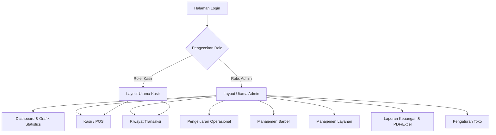
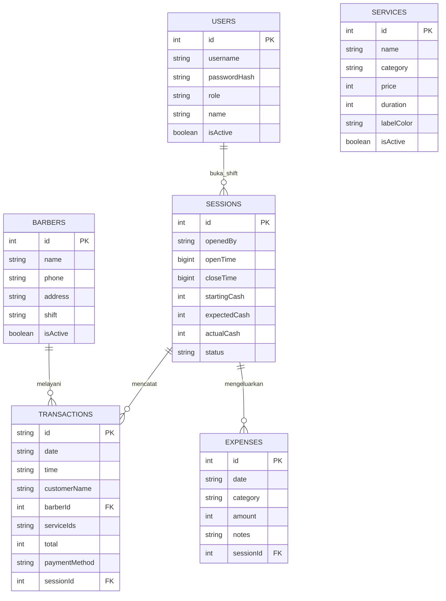
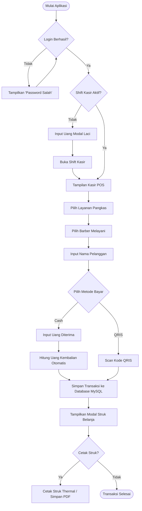
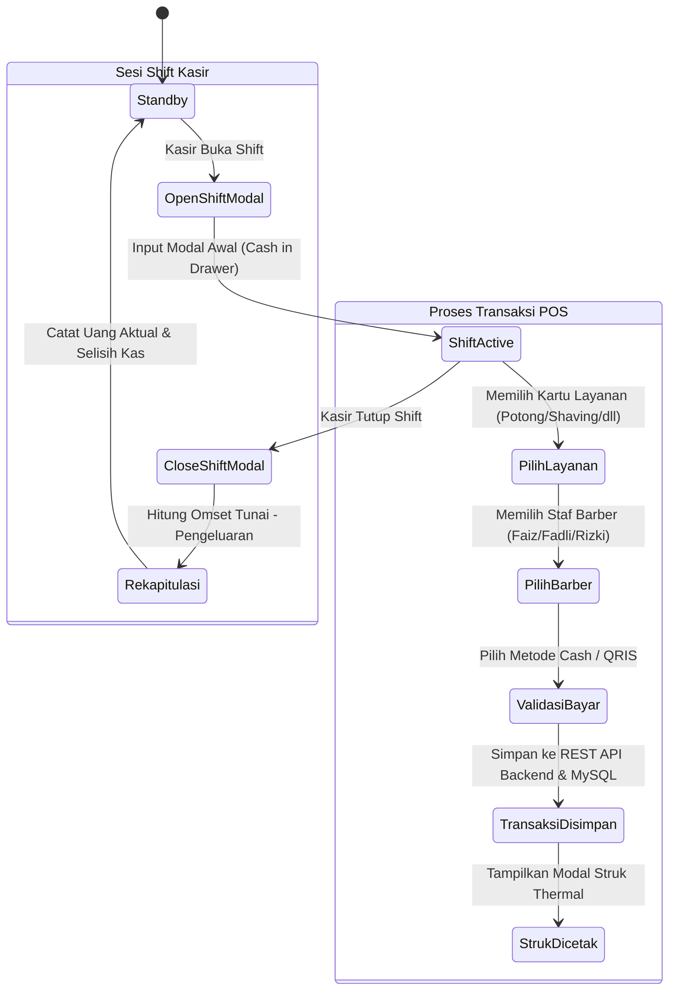

# DOKUMEN PERANCANGAN DIAGRAM UKK PPLG
**Nama Proyek**: BarberFlow POS - Classic Barber Go  
**Kompetensi Keahlian**: Pengembangan Perangkat Lunak dan Gimmick (PPLG) / RPL  
**Kelompok**: Kelompok 2 | XII PPLG 1  

---

> [!IMPORTANT]
> Dokumen ini berisi **seluruh perancangan diagram teknis (Sitemap, Use Case, ERD, CDM, PDM, Flowchart, dan Activity Diagram)** yang dirancang khusus untuk proyek **BarberFlow POS (Classic Barber Go)** dan siap dipresentasikan di depan penguji UKK.

---

# 1. SITEMAP DIAGRAM (PETA SITUS & HAK AKSES)

Sitemap ini menggambarkan struktur navigasi halaman serta pembagian hak akses pengguna (*Admin* dan *Kasir*).



---

# 2. USE CASE DIAGRAM & DESKRIPSI AKTOR

Use Case Diagram menggambarkan interaksi antara aktor (*Administrator* dan *Kasir*) dengan fungsi-fungsi utama dalam sistem.

```mermaid
usecaseDiagram
    actor Admin as "Administrator"
    actor Cashier as "Kasir"
    
    usecase UC1 as "Login Akun"
    usecase UC2 as "Buka / Tutup Shift Kasir"
    usecase UC3 as "Input Transaksi Kasir POS"
    usecase UC4 as "Cetak Struk Belanja"
    usecase UC5 as "Lihat & Hapus Riwayat"
    usecase UC6 as "Kelola Data Barber"
    usecase UC7 as "Kelola Data Layanan"
    usecase UC8 as "Kelola Pengeluaran"
    usecase UC9 as "Lihat Dashboard & Laporan"
    usecase UC10 as "Export PDF / Excel"

    Cashier --> UC1
    Cashier --> UC2
    Cashier --> UC3
    Cashier --> UC4
    Cashier --> UC5
    
    Admin --> UC1
    Admin --> UC2
    Admin --> UC3
    Admin --> UC4
    Admin --> UC5
    Admin --> UC6
    Admin --> UC7
    Admin --> UC8
    Admin --> UC9
    Admin --> UC10
```

### Tabel Deskripsi Aktor & Hak Akses:
| Aktor | Peran & Deskripsi | Hak Akses Fitur |
| :--- | :--- | :--- |
| **Administrator** | Pemilik toko / pengelola utama sistem | Akses penuh ke seluruh modul (Dashboard, Kasir, Riwayat, Pengeluaran, Barber, Layanan, Laporan, Pengaturan). |
| **Kasir** | Petugas meja kasir pangkas rambut | Dibatasi hanya untuk transaksi di halaman **Kasir POS** dan **Riwayat Transaksi**. |

---

# 3. ERD (ENTITY RELATIONSHIP DIAGRAM)

ERD menggambarkan hubungan antarentitas data relasional dalam database MySQL **barberflow_db**.



---

# 4. CDM (CONCEPTUAL DATA MODEL)

CDM menggambarkan hubungan konseptual dan aturan kardinalitas antar entitas bisnis:

| Entitas Utama | Deskripsi Entitas | Entitas Relasi | Kardinalitas | Penjelasan Kardinalitas |
| :--- | :--- | :--- | :--- | :--- |
| **USERS** | Data akun Admin & Kasir | **SESSIONS** | 1 to Many (1:N) | Satu user dapat membuka banyak sesi shift kasir sepanjang waktu. |
| **BARBERS** | Data staf pangkas rambut | **TRANSACTIONS** | 1 to Many (1:N) | Satu barber dapat melayani banyak transaksi pelanggan. |
| **SERVICES** | Katalog jenis pangkas/treatment | **TRANSACTIONS** | Many to Many (M:N) | Banyak layanan dapat dipilih dalam banyak transaksi (disimpan via CSV ID). |
| **SESSIONS** | Sesi shift kas aktif (Buka/Tutup) | **TRANSACTIONS** | 1 to Many (1:N) | Satu sesi shift mencatat banyak transaksi kasir hari itu. |
| **SESSIONS** | Sesi shift kas aktif (Buka/Tutup) | **EXPENSES** | 1 to Many (1:N) | Satu sesi shift mencatat banyak pengeluaran operasional toko. |

---

# 5. PDM (PHYSICAL DATA MODEL)

PDM merupakan skema struktur tabel fisik fisik pada database MySQL **barberflow_db**:

### 1. Tabel `users`
- `id` INT AUTO_INCREMENT PRIMARY KEY
- `username` VARCHAR(50) UNIQUE NOT NULL
- `passwordHash` VARCHAR(255) NOT NULL
- `role` VARCHAR(20) NOT NULL (`admin` / `cashier`)
- `name` VARCHAR(100) NOT NULL
- `isActive` BOOLEAN DEFAULT TRUE

### 2. Tabel `barbers`
- `id` INT AUTO_INCREMENT PRIMARY KEY
- `name` VARCHAR(100) UNIQUE NOT NULL
- `phone` VARCHAR(30)
- `address` TEXT
- `shift` VARCHAR(20) DEFAULT 'Pagi'
- `isActive` BOOLEAN DEFAULT TRUE

### 3. Tabel `services`
- `id` INT AUTO_INCREMENT PRIMARY KEY
- `name` VARCHAR(100) UNIQUE NOT NULL
- `category` VARCHAR(50)
- `price` INT NOT NULL
- `duration` INT
- `labelColor` VARCHAR(10)
- `isActive` BOOLEAN DEFAULT TRUE

### 4. Tabel `sessions`
- `id` INT AUTO_INCREMENT PRIMARY KEY
- `openedBy` VARCHAR(50) NOT NULL
- `openTime` BIGINT NOT NULL
- `closeTime` BIGINT
- `startingCash` INT NOT NULL
- `expectedCash` INT DEFAULT 0
- `actualCash` INT
- `status` VARCHAR(20) DEFAULT 'open'
- `notes` TEXT

### 5. Tabel `transactions`
- `id` VARCHAR(50) PRIMARY KEY (misal: '001', 'TRX-20260728-0001')
- `date` VARCHAR(20) NOT NULL
- `time` VARCHAR(20) NOT NULL
- `customerName` VARCHAR(100)
- `barberId` INT NOT NULL (FOREIGN KEY -> `barbers.id`)
- `serviceIds` VARCHAR(255) NOT NULL (ID Layanan terpisah koma)
- `subtotal` INT NOT NULL
- `total` INT NOT NULL
- `paymentMethod` VARCHAR(20) NOT NULL (`Cash` / `QRIS`)
- `createdAt` BIGINT NOT NULL
- `sessionId` INT (FOREIGN KEY -> `sessions.id`)
- `cashReceived` INT
- `changeReturned` INT

---

# 6. FLOWCHART SISTEM (ALUR TRANSAKSI KASIR POS)

Flowchart ini menggambarkan langkah demi langkah alur logika dari aplikasi dimulai dari login hingga transaksi selesai.



---

# 7. ACTIVITY DIAGRAM (SESI SHIFT & PEMBAYARAN KASIR)

Activity Diagram menggambarkan aktivitas dan alur kerja (*workflow*) antara pengguna dan sistem.


