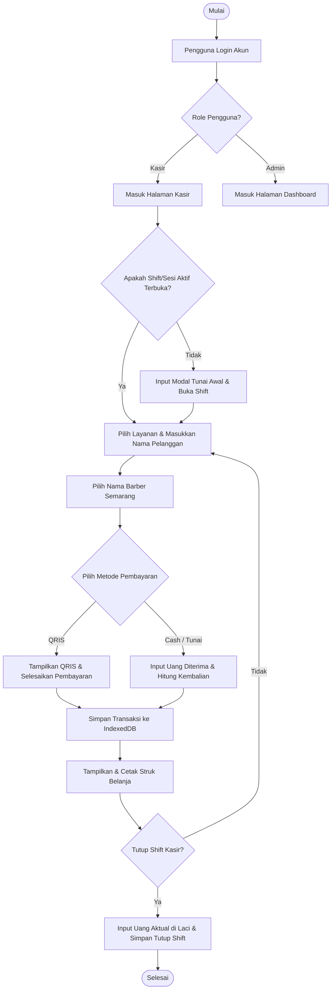
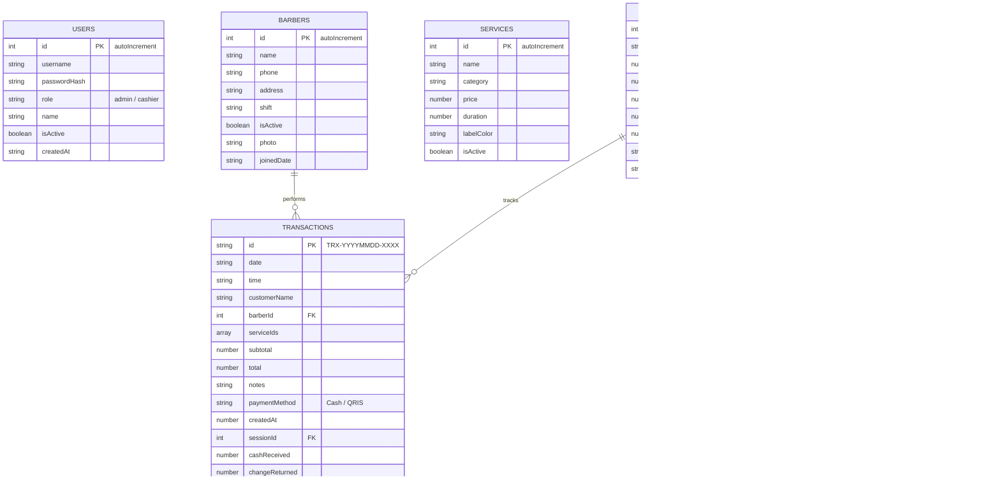
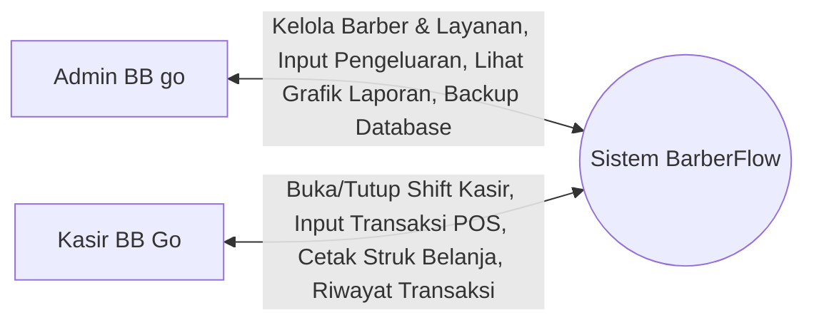
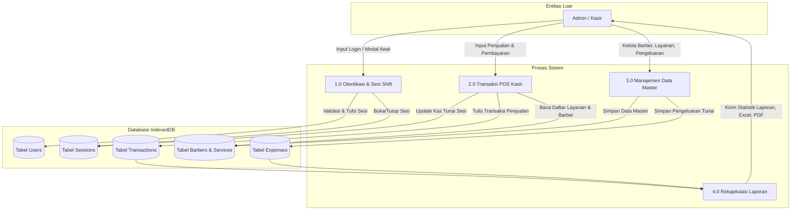

# Panduan & Dokumentasi Analisis Sistem BarberFlow
### Pendukung Uji Kompetensi Keahlian (UKK) - Jurusan Pengembangan Perangkat Lunak dan Gim (PPLG)

Dokumen ini disusun untuk memenuhi kriteria penilaian **Pra-UKK/UKK** nomor 1 sampai 14 agar mendapatkan nilai maksimal (**86 - 100**).

---

## 1. Flowchart Analisis Sistem (Kriteria 1)
Berikut adalah diagram alir (*flowchart*) operasional transaksi harian pada aplikasi BarberFlow:

---

## 2. Jadwal Kerja / Time Schedule (Kriteria 2)
Berikut adalah *Time Schedule* resmi pelaksanaan proyek BarberFlow beserta status realisasi pengerjaan:

| No. | Uraian Kegiatan | Durasi Waktu | Pelaksanaan | Realisasi | Keterangan |
| :--- | :--- | :---: | :---: | :---: | :--- |
| 1 | Riset/Pengumpulan Data, Mendefinisikan Masalah, Merancang Fitur Aplikasi dan Alur Sistem | 1 Minggu | 20 – 24 Juli 2026 | 20 – 22 Juli 2026 | Selesai Lebih Cepat |
| 2 | Membuat Desain Mock Up UI/UX | 1 Minggu | 27 – 31 Juli 2026 | 22 – 23 Juli 2026 | Selesai Lebih Cepat |
| 3 | Membuat FrontEnd, BackEnd, Database serta Integrasi API | 2 Minggu | 3 – 14 Agustus 2026 | 23 – 24 Juli 2026 | Selesai Lebih Cepat |
| 4 | Pengujian / Testing | 3 Hari | 15 – 17 Agustus 2026 | 24 Juli 2026 | Selesai Lebih Cepat |
| 5 | Penilaian | 3 Hari | 18 – 20 Agustus 2026 | [Menunggu Jadwal] | Siap Dinilai |

---

## 3. Perencanaan Anggaran / Biaya (Kriteria 3)
BarberFlow dirancang dengan arsitektur **Offline-First**, sehingga meminimalisir biaya server backend/database online:

| No. | Deskripsi Kebutuhan | Biaya Satuan | Total Biaya | Keterangan |
| :--- | :---: | :---: | :---: | :--- |
| 1 | Laptop Core i3, RAM 8GB (Hardware) | Rp5.000.000 | Rp5.000.000 | Perangkat kerja developer |
| 2 | Visual Studio Code, Git, Chrome (Software) | Rp0 (Open Source) | Rp0 | Perangkat lunak pengembangan |
| 3 | IndexedDB Browser Storage (Database) | Rp0 (Built-in Browser) | Rp0 | Penyimpanan lokal persisten |
| 4 | GitHub Repository (Version Control) | Rp0 (Free Tier) | Rp0 | Penyimpanan source code cloud |
| 5 | Vercel Hosting (Cloud Deployment) | Rp0 (Free Hobby Tier) | Rp0 | Hosting PWA web online |
| **-** | **Total Anggaran Pengeluaran** | **-** | **Rp5.000.000** | **Sangat hemat & efisien!** |

---

## 4. Entity Relationship Diagram / ERD (Kriteria 4)
Struktur relasi data dalam database lokal IndexedDB `barberflow_db`:

---

## 5. Diagram Konteks / Context Diagram (Kriteria 5)
Diagram yang mendefinisikan batasan sistem dan entitas luar yang berinteraksi dengan BarberFlow:

---

## 6. Data Flow Diagram / DFD Level 0 (Kriteria 6)
Aliran data internal antar proses dan penyimpanan data (data store) dalam BarberFlow:

---

## 7. Pemetaan Kriteria Penilaian Implementasi (Kriteria 7 - 14)

| No. | Kriteria Penilaian UKK | Bukti Implementasi pada BarberFlow | File Referensi Kode |
| :--- | :--- | :--- | :--- |
| **7** | Kesesuaian Tipe Data | Seluruh tipe data dikunci ketat menggunakan TypeScript Interfaces dan divalidasi dengan Zod resolver sebelum disimpan ke database. | [types/index.ts](file:///C:/Users/ASUS/.gemini/antigravity/scratch/barberflow/src/types/index.ts) |
| **8** | Standar Kode & Best Practices | Menggunakan standar ESLint/Oxlint, struktur folder modular React, penulisan nama variabel camelCase, komentar dokumentasi, dan indentasi rapi. | `src/` |
| **9** | UI/UX Standar Industri | Desain premium Dark Gold Theme, responsif ke layar smartphone, transisi mulus menggunakan framer-motion, dan animasi visual chart grafik. | [styles/index.css](file:///C:/Users/ASUS/.gemini/antigravity/scratch/barberflow/src/styles/index.css) |
| **10** | Simpan Data (Create) | Menambahkan data transaksi kasir, pencatatan pembukaan shift baru, penambahan data pekerja barber, dan penambahan layanan baru ke database lokal. | [db.ts](file:///C:/Users/ASUS/.gemini/antigravity/scratch/barberflow/src/database/db.ts) |
| **11** | Ubah Data (Update) | Mengubah data barber, menyunting daftar harga layanan, memperbarui nama/metode bayar di riwayat, dan penutupan shift kasir. | [db.ts](file:///C:/Users/ASUS/.gemini/antigravity/scratch/barberflow/src/database/db.ts) |
| **12** | Hapus Data (Delete) | Menghapus riwayat transaksi dengan proteksi validasi relasi, menghapus data pengeluaran, serta menonaktifkan barber/layanan. | [db.ts](file:///C:/Users/ASUS/.gemini/antigravity/scratch/barberflow/src/database/db.ts) |
| **13** | Pencarian Data (Search) | Fitur pencarian filter realtime kata kunci layanan di POS, pencarian nama pelanggan di riwayat transaksi, dan pencarian nama barber. | [Cashier.tsx](file:///C:/Users/ASUS/.gemini/antigravity/scratch/barberflow/src/pages/Cashier.tsx) |
| **14** | Tampil Data (Read) | Menampilkan rekap diagram penjualan di Dashboard, tabel riwayat kasir dengan pagination, dan laporan performa kerja per barber. | [Dashboard.tsx](file:///C:/Users/ASUS/.gemini/antigravity/scratch/barberflow/src/pages/Dashboard.tsx) |
