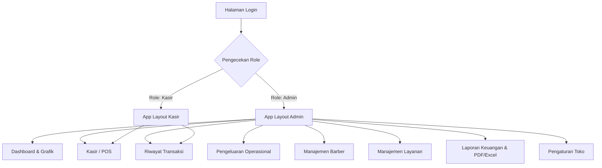
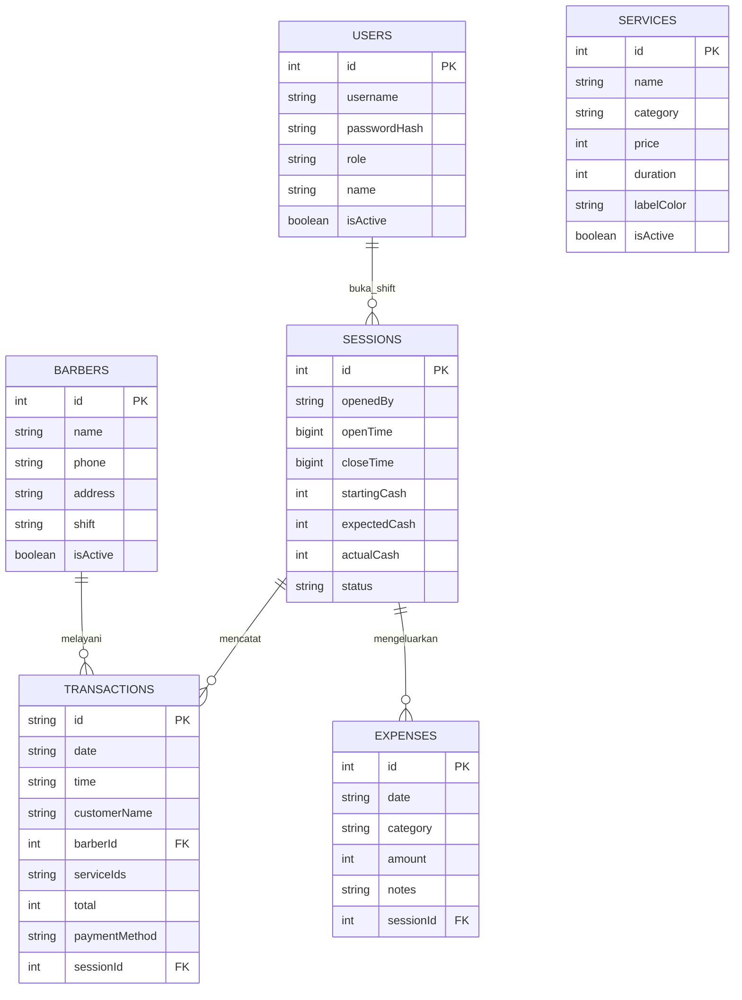
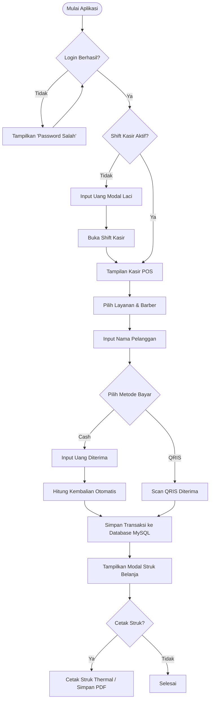
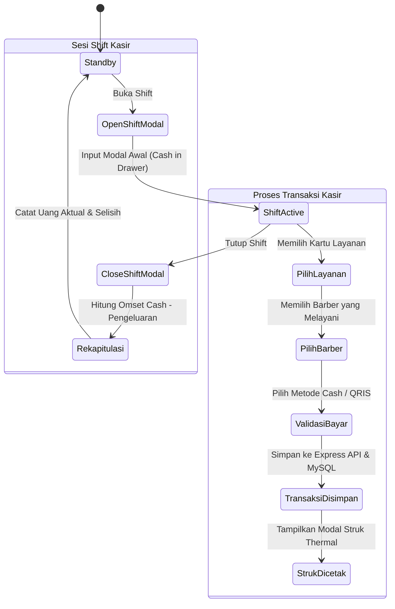

# PROPOSAL PROYEK & PERANCANGAN DIAGRAM UKK
**Nama Proyek**: BarberFlow POS - Classic Barber Go  
**Mata Pelajaran/Kompetensi**: Uji Kompetensi Keahlian (UKK) PPLG / RPL 2026  
**Penyusun**: Fazaa | XII PPLG 1  

---

> [!IMPORTANT]
> Dokumen ini berisi **Proposal Web Lengkap** dan seluruh **Diagram Perancangan Sistem (Sitemap, Use Case, ERD, CDM, PDM, Flowchart, dan Activity Diagram)** yang siap dicetak atau dipresentasikan di hadapan penguji UKK.

---

# BAB I: PROPOSAL PROYEK WEB

## 1.1 Pendahuluan & Latar Belakang
Perkembangan usaha barbershop saat ini mengalami peningkatan yang pesat seiring dengan tingginya kesadaran pria terhadap penampilan (*grooming*). Namun, sebagian besar unit usaha barbershop skala menengah masih mencatat transaksi secara manual menggunakan buku nota fisik. Penggunaan nota manual ini memiliki banyak kelemahan, seperti risiko kehilangan data transaksi, potensi kecurangan uang di laci kasir, perhitungan laporan laba rugi yang lambat, serta kesulitan memantau bagi hasil (*revenue share*) untuk setiap barber.

Untuk mengatasi permasalahan tersebut, dibangunlah **BarberFlow POS (Classic Barber Go)**, sebuah aplikasi kasir web modern (*Point of Sale*) berbasis **Full-Stack (React.js + Node.js Express + MySQL Database)**. Aplikasi ini dirancang khusus untuk mempermudah operasional kasir, mengelola data pangkas rambut dan barber secara efisien, serta menyediakan laporan keuangan yang akurat dan transparan secara *realtime*.

## 1.2 Tujuan Proyek
1. Membangun aplikasi kasir web POS yang responsif, cepat, dan mudah digunakan oleh kasir maupun pemilik bisnis.
2. Menyediakan fitur manajemen **Shift Kasir (Open/Close Shift)** untuk mencatat modal laci awal dan uang aktual saat tutup toko demi mencegah selisih kasir.
3. Otomatisasi perhitungan pendapatan bulanan, laba bersih, serta persentase bagi hasil (*share*) per barber.
4. Memudahkan pencetakan struk belanja thermal serta *export* laporan ke format PDF dan Excel.

## 1.3 Manfaat Sistem
* **Bagi Kasir**: Proses input transaksi menjadi sangat cepat, kembalian dihitung otomatis, dan riwayat transaksi tersimpan rapi.
* **Bagi Pemilik/Admin**: Dapat memantau omset harian, mengelola daftar barber dan layanan, serta menganalisis performa toko via dashboard grafik visual.

## 1.4 Spesifikasi Teknologi & Sumber Informasi
* **Front-End**: React.js (Vite), TypeScript, HTML5, CSS3 Variables, Lucide Icons, Chart.js, Framer Motion.
* **Back-End**: Node.js, Express.js (REST API Router), CORS, Dotenv.
* **Database**: MySQL Server (Relational Database Management System).
* **Library Ekspor**: jsPDF, AutoTable, SheetJS (XLSX).

---

# BAB II: PERANCANGAN DIAGRAM SISTEM

## 2.1 Sitemap Diagram (Peta Situs & Hak Akses)



---

## 2.2 Use Case Diagram

```mermaid
usecaseDiagram
    actor Admin as "Administrator"
    actor Cashier as "Kasir"
    
    usecase UC1 as "Login Akun"
    usecase UC2 as "Buka / Tutup Shift Kasir"
    usecase UC3 as "Input Transaksi Kasir POS"
    usecase UC4 as "Cetak Struk Belanja"
    usecase UC5 as "Lihat & Hapus Riwayat"
    usecase UC6 as "Kelola Data Barber"
    usecase UC7 as "Kelola Data Layanan"
    usecase UC8 as "Kelola Pengeluaran"
    usecase UC9 as "Lihat Dashboard & Laporan"
    usecase UC10 as "Export PDF / Excel"

    Cashier --> UC1
    Cashier --> UC2
    Cashier --> UC3
    Cashier --> UC4
    Cashier --> UC5
    
    Admin --> UC1
    Admin --> UC2
    Admin --> UC3
    Admin --> UC4
    Admin --> UC5
    Admin --> UC6
    Admin --> UC7
    Admin --> UC8
    Admin --> UC9
    Admin --> UC10
```

---

## 2.3 ERD (Entity Relationship Diagram)



---

## 2.4 CDM (Conceptual Data Model)

CDM menggambarkan hubungan konseptual antarentitas bisnis utama dalam aplikasi tanpa memperhatikan detail penyimpanan fisik:

| Entitas Utama | Deskripsi Entitas | Relasi Entitas | Kardinalitas |
| :--- | :--- | :--- | :--- |
| **USERS** | Menyimpan data akun pengguna (Admin & Kasir) | Membuka Sesi Kasir (`SESSIONS`) | 1 to Many (1:N) |
| **BARBERS** | Menyimpan profil barber (Pangkas) | Melayani Transaksi (`TRANSACTIONS`) | 1 to Many (1:N) |
| **SERVICES** | Menyimpan katalog jenis pangkas/perawatan | Dipilih dalam Transaksi (`TRANSACTIONS`) | Many to Many (M:N via CSV IDs) |
| **SESSIONS** | Sesi shift kasir aktif (Modal laci awal & tutup kas) | Mengelompokkan Transaksi & Pengeluaran | 1 to Many (1:N) |
| **TRANSACTIONS** | Bukti transaksi penjualan pangkas rambut | Terikat pada Barber & Sesi Kasir | Many to 1 (N:1) |
| **EXPENSES** | Catatan pengeluaran operasional toko harian | Terikat pada Sesi Kasir | Many to 1 (N:1) |

---

## 2.5 PDM (Physical Data Model)

PDM merupakan perancangan struktur tabel fisik database MySQL rill yang diimplementasikan pada file [schema.sql](file:///C:/Users/ASUS/.gemini/antigravity/scratch/barberflow/backend/schema.sql):

### 1. Tabel `users`
* `id` INT AUTO_INCREMENT PRIMARY KEY
* `username` VARCHAR(50) UNIQUE NOT NULL
* `passwordHash` VARCHAR(255) NOT NULL
* `role` VARCHAR(20) NOT NULL -- 'admin' / 'cashier'
* `name` VARCHAR(100) NOT NULL
* `isActive` BOOLEAN DEFAULT TRUE

### 2. Tabel `barbers`
* `id` INT AUTO_INCREMENT PRIMARY KEY
* `name` VARCHAR(100) UNIQUE NOT NULL
* `phone` VARCHAR(30)
* `address` TEXT
* `shift` VARCHAR(20) DEFAULT 'Pagi'
* `isActive` BOOLEAN DEFAULT TRUE

### 3. Tabel `services`
* `id` INT AUTO_INCREMENT PRIMARY KEY
* `name` VARCHAR(100) UNIQUE NOT NULL
* `category` VARCHAR(50)
* `price` INT NOT NULL
* `duration` INT
* `labelColor` VARCHAR(10)
* `isActive` BOOLEAN DEFAULT TRUE

### 4. Tabel `sessions`
* `id` INT AUTO_INCREMENT PRIMARY KEY
* `openedBy` VARCHAR(50) NOT NULL
* `openTime` BIGINT NOT NULL
* `closeTime` BIGINT
* `startingCash` INT NOT NULL
* `expectedCash` INT DEFAULT 0
* `actualCash` INT
* `status` VARCHAR(20) DEFAULT 'open'
* `notes` TEXT

### 5. Tabel `transactions`
* `id` VARCHAR(50) PRIMARY KEY -- e.g. '001', 'TRX-17849102'
* `date` VARCHAR(20) NOT NULL
* `time` VARCHAR(20) NOT NULL
* `customerName` VARCHAR(100)
* `barberId` INT NOT NULL (FK -> `barbers.id`)
* `serviceIds` VARCHAR(255) NOT NULL -- e.g. "1,3"
* `subtotal` INT NOT NULL
* `total` INT NOT NULL
* `paymentMethod` VARCHAR(20) NOT NULL -- 'Cash' / 'QRIS'
* `createdAt` BIGINT NOT NULL
* `sessionId` INT (FK -> `sessions.id`)
* `cashReceived` INT
* `changeReturned` INT

---

## 2.6 Flowchart Sistem (Alur Kasir POS)



---

## 2.7 Activity Diagram (Sesi Shift & Pembayaran Kasir)



---

## BAB III: KESIMPULAN & PENUTUP

Aplikasi **BarberFlow POS (Classic Barber Go)** telah memenuhi seluruh kriteria kelayakan proyek Uji Kompetensi Keahlian (UKK) PPLG/RPL. Dengan integrasi arsitektur Full-Stack yang solid, perancangan basis data relasional yang efisien, serta tampilan UI visual modern yang presisi sesuai mockup Figma, aplikasi ini siap diujikan dan diimplementasikan secara langsung pada unit bisnis pangkas rambut rill.
